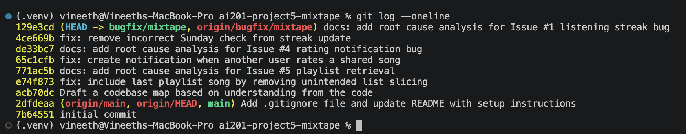

# AI Usage

I used AI primarily to understand the existing codebase and navigate through the different layers before making any code changes. During the orientation phase, I used AI to explain the responsibilities of the main files, summarize how the application was organized, and help trace execution paths from the route layer to the corresponding service functions. This helped me build a codebase map before starting any debugging.

While investigating individual issues, I used AI to explain specific functions after I had already identified them through my own code tracing. For example, I used it to walk through the logic in `get_playlist_songs()`, `rate_song()`, and `update_listening_streak()` to better understand how the code behaved and to compare the implementation with the documented behavior before deciding on a fix.

I did not rely on AI to identify bugs automatically. For every issue, I first reproduced the behavior myself using API requests and Flask shell, then traced the execution flow through the relevant routes and services before confirming the root cause. I also verified AI's explanations by reading the code directly, querying the database where necessary, and rerunning the API calls and automated tests after each fix to confirm that the changes resolved the issue without introducing regressions.

---

# Codebase Map

Before looking into any of the reported issues, I spent some time understanding how the application is organized and how requests flow through the different layers.

### Main files and their responsibilities

`app.py` is the application's entry point. It creates the Flask application, loads the configuration, initializes SQLAlchemy, registers the blueprints for the Songs, Playlists, Users, and Feed modules, and creates the database tables during startup.

`models.py` defines all of the application's database models and relationships. The main entities are `User`, `Song`, `ListeningEvent`, `Rating`, `Playlist`, `Notification`, and `Tag`. It also defines the association tables used for many-to-many relationships, including friendships between users, song tags, and playlist entries. One thing I noticed is that playlist ordering is not based on insertion order. Instead, the `playlist_entries` association table stores a separate `position` field along with information about who added the song and when it was added.

The `routes` folder contains the API endpoints. These files mainly validate request data, call the appropriate service function, and return JSON responses. They contain very little business logic.

* `routes/songs.py` handles song search, song details fetch, song ratings, and listening events.
* `routes/playlists.py` handles playlist creation, retrieving playlists, viewing playlist songs, and adding songs to playlists.
* `routes/users.py` handles user information, listening streaks, notifications, and marking notifications as read.
* `routes/feed.py` handles the Friends Listening Now feed and the activity feed.

The `services` folder contains the application's business logic. This is where most database queries, calculations, and feature-specific processing happen.

* `streak_service.py` manages listening events and updates listening streaks.
* `feed_service.py` generates the Friends Listening Now feed and the general activity feed.
* `search_service.py` performs song search and retrieves song details.
* `notification_service.py` creates notifications, records song ratings, handles playlist notification logic, retrieves notifications, and marks notifications as read.
* `playlist_service.py` creates playlists and retrieves playlist metadata and playlist songs.

`seed_data.py` populates the database with sample users, songs, playlists, friendships, listening events, ratings, and notifications so the application has realistic data for testing.

The `tests` folder contains automated checks for streak logic, song search behavior, and playlist retrieval. These tests reflect intended behavior and are useful later for confirming that fixes do not break related functionality.

### Architecture and organization

The application follows a consistent Route → Service → Model architecture.

The routes are responsible for handling HTTP requests, validating inputs, and formatting responses. Almost every route delegates the actual work to a service function. The services contain the business logic and interact with the database through the SQLAlchemy models. The models define the application's data structure and relationships.

Because every feature follows this same pattern, once I identified the route for a feature, it was straightforward to trace execution into the corresponding service and then to the relevant database models.

### Example data flow: Adding a song to a playlist

When a user adds a song to a playlist, the request first reaches `POST /playlists/<playlist_id>/songs` in `routes/playlists.py`.

The route validates that both `song_id` and `added_by` are present in the request before calling `add_to_playlist()` in `notification_service.py`.

Inside `add_to_playlist()`, the service retrieves the `Song`, `User`, and `Playlist` records from the database. If the song is not already part of the playlist, it is added to the playlist and the database is updated. After that, if the user adding the song is different from the user who originally shared it, the service creates a new `Notification` record so the original sharer is informed that their song was added to a playlist.

The overall execution flow for this feature is:

**HTTP Request → Route → Service → SQLAlchemy Models → Database → JSON Response**

### Overall observations

One pattern I noticed throughout the project is that the routes remain intentionally thin, while the service layer contains almost all of the application logic. This separation makes the codebase easier to navigate because each layer has a clear responsibility. After identifying the correct route, I could consistently follow the same execution path into the service layer and then to the underlying models and database operations.

---

# Root Cause Analysis

## Issue #5: The last song in a playlist never shows up

### How I reproduced it

I first seeded the database and started the Flask application. Since there wasn't an endpoint to list all playlists, I opened the Flask shell and queried the `Playlist` model to retrieve a valid playlist ID.

Using that playlist ID, I sent a `GET /playlists/<playlist_id>/songs` request. The API returned 6 songs for the playlist.

To verify whether the issue was with the database or the application's retrieval logic, I opened the Flask shell again and queried the same playlist using SQLAlchemy. I retrieved the songs associated with the playlist through the `playlist_entries` association table and confirmed that the database actually contained 7 songs in the correct order. Since the database contained all 7 songs but the API returned only 6, I confirmed that the last song was being omitted during the retrieval process rather than being missing from the database.

### How I found the root cause

I started from the `GET /playlists/<playlist_id>/songs` route in `routes/playlists.py` and followed the call to `get_playlist_songs()` in `playlist_service.py`. The database query correctly retrieved all songs for the playlist and ordered them using the `position` column from the `playlist_entries` association table.

The point that confirmed the root cause was the return statement. Although the query returned the complete list of songs, the function converted only `songs[:-1]` into the response, which excluded the final song before returning the result.

### The root cause

The database query was returning all songs in the playlist correctly, but the final return statement sliced the list using `songs[:-1]`. In Python, this slice returns every element except the last one. As a result, the API always omitted the final song in the playlist even though it existed in the database and had been retrieved successfully.

### Your fix and side-effect check

I removed the unnecessary list slicing and returned the complete list of songs retrieved by the query. This ensured that every song in the playlist was included in the API response while preserving the existing ordering logic.

After making the change, I called the `GET /playlists/<playlist_id>/songs` endpoint again and confirmed that it now returned all 7 songs in the playlist. I also ran the playlist test suite, and all tests passed successfully, confirming that playlist ordering and empty playlist behavior were not affected by the fix.

---

## Issue #4: I got notified when a friend added my song to a playlist but not when they rated it

### How I reproduced it

I first used `User.query.all()` and `Song.query.all()` in the Flask shell to identify a valid user and a song. I selected a user who had already received a notification indicating that another user had added their shared song, **"Midnight Drive,"** to a playlist. This confirmed that the selected user was the owner of that song.

Before rating the song, I called `GET /users/<owner_id>/notifications` and confirmed that the owner had one existing playlist notification.

Next, I sent a `POST /songs/<song_id>/rate` request using a different user's ID and a valid rating score for the same song. The request completed successfully and returned the newly created rating.

Finally, I called `GET /users/<owner_id>/notifications` again. The notification count remained the same, and no new notification was created for the rating action. This confirmed that although the rating was successfully recorded, the song owner was not notified when another user rated their song.

### How I found the root cause

I started by tracing the working notification flow. I followed the `POST /playlists/<playlist_id>/songs` route in `routes/playlists.py`, which calls `notification_service.add_to_playlist()`. That function adds the song to the playlist and then calls `create_notification()` for the original song owner. This explained why playlist additions were generating notifications successfully.

Next, I traced the rating flow by following `POST /songs/<song_id>/rate` in `routes/songs.py` to `notification_service.rate_song()`. The function validated the request, created or updated the `Rating` record, and committed the changes to the database. However, unlike the playlist flow, it never called `create_notification()` before returning the response. Comparing these two similar workflows made it clear that the rating path was missing the notification step.

### The root cause

The `rate_song()` function handled creating or updating the rating correctly, but it returned immediately after saving the `Rating` record without creating a notification for the song owner. As a result, the rating was successfully stored in the database, but there was no code to notify the owner that another user had rated their song. In contrast, the playlist flow explicitly called `create_notification()` after adding a song to a playlist, which is why that feature behaved as expected.

### Your fix and side-effect check

I added notification creation to the rating flow so that when a user rates another person's song, the song owner receives a new `song_rated` notification. To keep the behavior consistent with the playlist flow, the notification is only created when the person rating the song is different from the song owner.

After making the change, I repeated the same API flow I used during reproduction. I checked the song owner's notifications before rating the song, submitted a new rating using a different user, and then checked the notifications again. This time the owner had two notifications instead of one, and the new notification correctly indicated that another user had rated their song. I also verified that the existing playlist notification was still present, confirming that the change fixed the missing rating notification without affecting the existing notification functionality.

---

## Issue #1: My listening streak keeps resetting

### How I reproduced it

I opened the Flask shell, selected a valid user from the database, and called `update_listening_streak()` with two controlled timestamps, first on Saturday and then on Sunday.

After the Saturday update, the listening streak became 1 as expected. I then called the same function with a Sunday timestamp. Instead of incrementing the streak to 2 for two consecutive days, the streak remained at 1. This confirmed that the streak was incorrectly resetting across the Saturday to Sunday boundary.

### How I found the root cause

I traced the listening flow from `POST /songs/<song_id>/listen` in `routes/songs.py` to `record_listening_event()` and then to `update_listening_streak()` in `streak_service.py`, where the streak logic is implemented.

I first read the function's docstring to understand the expected behavior. It states that the streak should increment whenever the user listens on consecutive calendar days. I then compared the implementation with the documented rules and found that the increment logic included an additional condition, `today.weekday() != 6`, which prevented the streak from increasing on Sundays. This mismatch between the documented behavior and the implementation confirmed the root cause.

### The root cause

The `update_listening_streak()` function correctly calculated the number of days since the user's previous listening event, but it only incremented the streak when `days_since_last == 1` **and** the current day was not Sunday. Since `datetime.weekday()` returns `6` for Sunday, every consecutive Saturday to Sunday transition failed the increment condition and fell through to the reset logic instead. This caused the streak to reset even though the user had listened on consecutive days.

### Your fix and side-effect check

I removed the unnecessary Sunday check so that the streak increments whenever the user listens on consecutive calendar days, regardless of which day of the week it is.

After making the change, I repeated the same Saturday to Sunday reproduction and confirmed that the streak now increased from 1 to 2 as expected. I also ran the streak test suite, which passed successfully. This verified that the fix resolved the Sunday edge case while preserving the existing behavior for first-time listens, multiple listens on the same day, and skipped days.

---

# Git History

The screenshot below shows the commit history for the `bugfix/mixtape` branch, including separate `fix:` commits for each bug fix.

